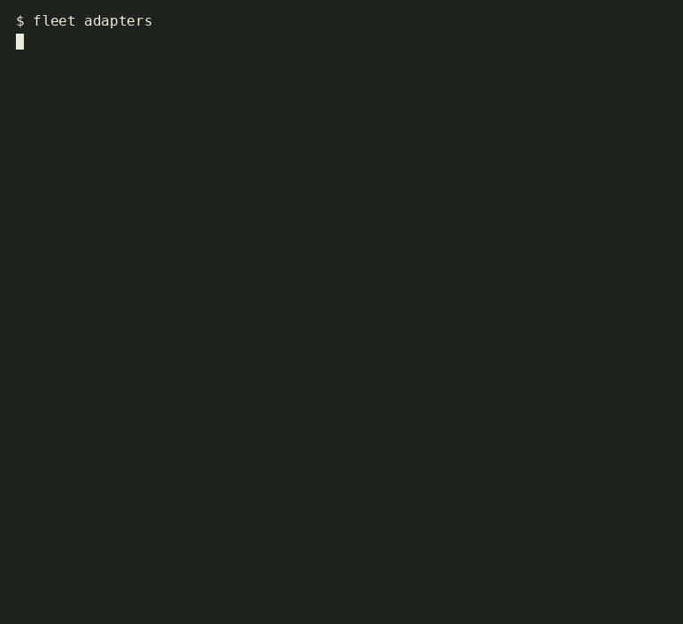

<p align="center">
  
</p>

<h3 align="center">Multi-agent fleet management for <a href="https://openclaw.ai">OpenClaw</a></h3>

<p align="center">
  <strong>One CLI to monitor, manage, and orchestrate your entire AI agent fleet.</strong>
</p>

<p align="center">
  <a href="https://github.com/oguzhnatly/fleet/actions"></a>
  <a href="https://clawhub.com"></a>
  <a href="LICENSE"></a>
  <a href="#"></a>
</p>

<p align="center">
  <a href="#quick-start">Quick Start</a> •
  <a href="#commands">Commands</a> •
  <a href="#patterns">Patterns</a> •
  <a href="#configuration">Configuration</a> •
  <a href="docs/">Docs</a>
</p>

---

You're running multiple [OpenClaw](https://openclaw.ai) gateways: a coordinator that thinks, employees that code, review, deploy, and research. Fleet gives your coordinator full operational awareness. Which agents are up, which CI is red, what changed since the last check.

<p align="center">
  <em>Built for AI agents to manage AI agents. Works on any system.</em>
</p>

<p align="center">
  
</p>

### Why Fleet?

🔍 **Visibility** · Know which agents are up, which CI is red, what changed overnight. One command, full picture.

📊 **Delta tracking** · SITREP remembers the last run. Only shows what _changed_. No noise.

🔧 **Zero config** · `fleet init` detects running gateways, discovers your workspace, links itself to PATH. One command to go from clone to operational.

🧩 **Modular** · Each command is a separate file. Adding a new command means dropping a `.sh` file in `lib/commands/`. No monolith, no framework.

⚡ **Agent native** · Designed to be _used by agents_, not just humans. The [SKILL.md](SKILL.md) teaches any OpenClaw agent to manage a fleet autonomously, install dependencies, and adapt to any environment. If bash isn't available, your agent figures out another way.

📦 **Pattern library** · Solo empire, dev team, research lab. Pre built configs for common setups.

## Quick Start

```bash
# Install via ClawHub
clawhub install fleet

# Or clone directly
git clone https://github.com/oguzhnatly/fleet.git
fleet/bin/fleet init    # links PATH, detects gateways, creates config

# Check your fleet
fleet agents
fleet health
fleet sitrep
```

## Commands

### Monitoring

| Command | Description |
|---------|-------------|
| `fleet health` | Health check all gateways and endpoints |
| `fleet agents` | Show agent fleet with live status and latency |
| `fleet sitrep [hours]` | Full SITREP with delta tracking |
| `fleet audit` | Check for misconfigurations and risks |

### Development

| Command | Description |
|---------|-------------|
| `fleet ci [filter]` | GitHub CI status across all repos |
| `fleet skills` | List installed ClawHub skills |

### Operations

| Command | Description |
|---------|-------------|
| `fleet backup` | Backup gateway configs, cron jobs, auth profiles |
| `fleet restore` | Restore from latest backup |
| `fleet init` | Interactive setup with gateway detection |

<details>
<summary><strong>See more command output examples</strong></summary>

#### `fleet agents`

```
Agent Fleet
───────────
  ⬢ coordinator      coordinator      claude-opus-4               :48391 online 13ms

  ⬢ coder            implementation   codex                       :48520 online 8ms
  ⬢ reviewer         code-review      codex                       :48540 online 9ms
  ⬡ deployer         deployment       codex                       :48560 unreachable
  ⬢ qa               quality-assurance codex                      :48580 online 7ms
```

#### `fleet audit`

```
Fleet Audit
───────────

Configuration
  ✅ Config file exists at ~/.fleet/config.json
  ✅ Config permissions: 600
  ✅ All agent tokens configured
  ✅ No placeholder tokens found

Agents
  ✅ All 5 agents online
  ✅ Main gateway healthy (:48391)

CI
  ✅ gh CLI available
  ✅ All CI green

Resources
  ✅ Memory usage: 43%
  ✅ Disk usage: 7%

Backups
  ✅ Last backup: 2 day(s) ago

  All clear · 11 checks passed, 0 warnings
```

#### `fleet ci`

```
CI Status
─────────

  frontend (myorg/frontend)
    ✅ Update homepage (main) passed 2h ago
    ✅ Fix footer (main) passed 4h ago

  backend (myorg/backend)
    ❌ Add endpoint (main) failed 1h ago
    ✅ Fix auth (main) passed 3h ago
```

#### `fleet health`

```
Fleet Health Check
──────────────────
  ✅ coordinator (:48391) 12ms

Endpoints
  ✅ website (200) 234ms
  ✅ api (200) 89ms
  ❌ docs UNREACHABLE

Services
  ✅ openclaw-gateway
```

</details>

## Patterns

Fleet supports any agent organization pattern. Three common ones:

### Solo Empire
> One brain, many hands. The indie hacker setup.

```
         Coordinator (Opus)
        /     |      \
    Coder  Reviewer  Deployer
   (Codex)  (Codex)   (Codex)
```

### Development Team
> Team leads managing specialized developers.

```
              Orchestrator (Opus)
            /        |         \
      FE Lead     BE Lead     QA Lead
     (Sonnet)    (Sonnet)    (Sonnet)
       / \          |           |
    Dev1  Dev2    Dev1       Tester
   (Codex)(Codex)(Codex)    (Codex)
```

### Research Lab
> Specialized agents for knowledge work.

```
            Director (Opus)
          /     |      \       \
    Scraper  Analyst  Writer  Fact Check
   (Codex)  (Sonnet) (Sonnet)  (Codex)
```

See [`docs/patterns.md`](docs/patterns.md) for detailed guides and [`examples/`](examples/) for configs.

## Configuration

Fleet reads `~/.fleet/config.json`. Create one with `fleet init` or manually:

```json
{
  "workspace": "~/workspace",
  "gateway": {
    "port": 48391,
    "name": "coordinator"
  },
  "agents": [
    { "name": "coder", "port": 48520, "role": "implementation", "model": "codex" },
    { "name": "reviewer", "port": 48540, "role": "code review", "model": "codex" }
  ],
  "endpoints": [
    { "name": "website", "url": "https://myapp.com" },
    { "name": "api", "url": "https://api.myapp.com/health" }
  ],
  "repos": [
    { "name": "frontend", "repo": "myorg/frontend" },
    { "name": "backend", "repo": "myorg/backend" }
  ]
}
```

Everything is configurable. No hardcoded ports, models, or names. Your fleet, your way.

See [`docs/configuration.md`](docs/configuration.md) for the full schema.

## Environment Variables

| Variable | Description | Default |
|----------|-------------|---------|
| `FLEET_CONFIG` | Config file path | `~/.fleet/config.json` |
| `FLEET_WORKSPACE` | Workspace override | Config value |
| `FLEET_STATE_DIR` | State persistence | `~/.fleet/state` |
| `NO_COLOR` | Disable colors | _(unset)_ |

## Architecture

```
fleet/
├── bin/fleet              # Entry point
├── lib/
│   ├── core/              # Config, output, state management
│   │   ├── config.sh      # JSON config loader
│   │   ├── output.sh      # Colors, formatting, HTTP helpers
│   │   └── state.sh       # Delta state persistence
│   └── commands/           # One file per command
│       ├── agents.sh       # Agent fleet status
│       ├── audit.sh        # Misconfiguration checker
│       ├── backup.sh       # Config backup/restore
│       ├── ci.sh           # GitHub CI integration
│       ├── health.sh       # Endpoint health checks
│       ├── init.sh         # Interactive setup
│       ├── sitrep.sh       # Structured status reports
│       └── skills.sh       # ClawHub skill listing
├── templates/configs/      # Config templates
├── examples/               # Architecture pattern examples
│   ├── solo-empire/
│   ├── dev-team/
│   └── research-lab/
├── docs/                   # Documentation
├── tests/                  # Integration tests
├── SKILL.md                # ClawHub agent instructions
└── .github/workflows/      # CI pipeline
```

Modular by design. Each command is a separate file. Add your own by dropping a `.sh` file in `lib/commands/`.

## For AI Agents

Fleet ships with a [`SKILL.md`](SKILL.md) that any OpenClaw agent can read. Install via ClawHub and your coordinator automatically knows how to manage the fleet:

```bash
clawhub install fleet
```

The agent reads the skill file, learns the commands, and runs health checks autonomously during heartbeat cycles.

## Requirements

| Dependency | Version | Notes |
|------------|---------|-------|
| bash | 4+ | macOS ships 3.2, run `brew install bash` |
| python3 | 3.10+ | No pip packages needed |
| curl | any | Pre installed on most systems |
| [OpenClaw](https://openclaw.ai) | any | Gateway support required |
| [gh CLI](https://cli.github.com/) | any | Optional, for CI commands |

## Contributing

Issues and PRs welcome. See [CONTRIBUTING.md](CONTRIBUTING.md) for guidelines.

Built by a solo operation, for solo operations.

## Support

If Fleet is useful to you, consider supporting its development:

<a href="https://github.com/sponsors/oguzhnatly">
  
</a>

## License

[MIT](LICENSE) · [Oguzhan Atalay](https://github.com/oguzhnatly)
