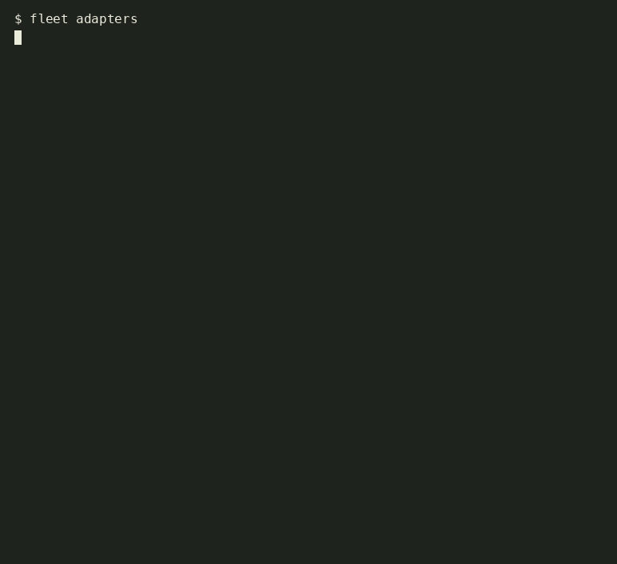

<p align="center">
  
</p>

<h3 align="center">Multi-agent fleet management for <a href="https://openclaw.ai">OpenClaw</a></h3>

<p align="center">
  <strong>One CLI to monitor, manage, and orchestrate your entire AI agent fleet.</strong>
</p>

<p align="center">
  📖 <a href="https://blog.oguzhanatalay.com/architecting-multi-agent-ai-fleet-single-vps"><strong>Read the story behind this →</strong></a>
</p>

<p align="center">
  <a href="https://github.com/oguzhnatly/fleet/actions"></a>
  <a href="https://clawhub.com"></a>
  <a href="LICENSE"></a>
  <a href="#"></a>
</p>

<p align="center">
  <a href="#quick-start">Quick Start</a> •
  <a href="#commands">Commands</a> •
  <a href="#patterns">Patterns</a> •
  <a href="#configuration">Configuration</a> •
  <a href="docs/">Docs</a>
</p>

---

You're running multiple [OpenClaw](https://openclaw.ai) gateways: a coordinator that thinks, employees that code, review, deploy, and research. Fleet is the operational layer that was missing. One CLI that gives your coordinator full visibility, control, and judgment over the entire fleet.

See what changed. Dispatch tasks. Learn which agents actually deliver, and route work to whoever you can trust. Works with any runtime — OpenClaw, HTTP, Docker, or bare OS processes — through a unified adapter interface.

<p align="center">
  <em>Built for AI agents to manage AI agents. Works on any system 🦞</em>
</p>

<p align="center">
  
</p>

### Why Fleet?

🔍 **Visibility**: Know which agents are up, which CI is red, what changed overnight. One command, full picture.

📊 **Delta tracking**: SITREP remembers the last run. Only shows what _changed_. No noise.

🔧 **Zero config**: `fleet init` detects running gateways, discovers your workspace, links itself to PATH. One command to go from clone to operational.

🧩 **Modular**: Each command is a separate file. Adding a new command means dropping a `.sh` file in `lib/commands/`. No monolith, no framework.

⚡ **Agent native**: Designed to be _used by agents_, not just humans. The [SKILL.md](SKILL.md) teaches any OpenClaw agent to manage a fleet autonomously. Explicit dependency installation steps are provided for every supported platform (bash 4+, python3 3.10+, curl).

📦 **Pattern library**: Solo empire, dev team, research lab. Pre built configs for common setups.

## Contents

- [Why Fleet?](#why-fleet)
- [Quick Start](#quick-start)
- [Commands](#commands)
  - [Dispatch](#dispatch)
  - [Monitoring](#monitoring)
  - [Development](#development)
  - [Operations](#operations)
- [Patterns](#patterns)
- [Configuration](#configuration)
- [Environment Variables](#environment-variables)
- [Architecture](#architecture)
- [For AI Agents](#for-ai-agents)
- [Requirements](#requirements)
- [Roadmap](#roadmap)
- [Contributing](#contributing)
- [Support](#support)

## Quick Start

```bash
# Install via ClawHub
clawhub install fleet

# Or via skills.sh (works with Claude Code, Codex, Cursor, Windsurf, and more)
npx skills add oguzhnatly/fleet

# Or clone directly
git clone https://github.com/oguzhnatly/fleet.git
fleet/bin/fleet init    # links PATH, detects gateways, creates config

# Check your fleet
fleet agents
fleet health
fleet sitrep
```

## Commands

### Dispatch

| Command | Description |
|---------|-------------|
| `fleet task <agent> "<prompt>"` | Dispatch a task to an agent, stream response live |
| `fleet steer <agent> "<message>"` | Send a mid-session correction to a running agent |
| `fleet watch <agent>` | Live session tail: polls every 3s, shows new messages as they arrive |
| `fleet parallel "<task>"` | Decompose into subtasks, assign by type, dispatch all concurrently |
| `fleet kill <agent>` | Send a graceful stop signal to an agent session |
| `fleet log` | Append-only structured log of all dispatches and outcomes |

### Monitoring

| Command | Description |
|---------|-------------|
| `fleet health` | Health check all gateways, endpoints, and v4 runtimes |
| `fleet agents` | Show agent fleet with live status and latency, plus v4 runtimes |
| `fleet sitrep [hours]` | Full SITREP with delta tracking across agents, CI, runtimes |
| `fleet audit` | Check for misconfigurations and risks |

### Cross-Runtime (v4)

| Command | Description |
|---------|-------------|
| `fleet adapters` | List registered adapters and their bindings to agents and runtimes |
| `fleet runtime add <name> <type>` | Register a new runtime (openclaw, http, docker, process) |
| `fleet runtime test <name>` | One-off probe of a runtime or agent (health + info + version) |
| `fleet runtime list` | Live status of every runtime, probed in parallel |
| `fleet runtime rm <name>` | Remove a runtime from the config |

### Development

| Command | Description |
|---------|-------------|
| `fleet ci [filter]` | GitHub CI status across all repos |
| `fleet skills` | List installed ClawHub skills |

### Operations

| Command | Description |
|---------|-------------|
| `fleet backup` | Backup gateway configs, cron jobs, auth profiles |
| `fleet restore` | Restore from latest backup |
| `fleet init` | Interactive setup with gateway detection |
| `fleet update` | Upgrade to the latest fleet release from GitHub |

<details>
<summary><strong>See command output examples</strong></summary>

#### `fleet task coder "add pagination to /api/spots, cursor-based, include tests"`

```
Fleet Task
──────────
  Agent     coder (port 48520)
  Type      code
  Task ID   a1b2c3d4
  Timeout   30m

  add pagination to /api/spots, cursor-based, include tests

  ────────────────────────────────────────
  I'll add cursor-based pagination to the /api/spots endpoint.

  Starting with the database query layer...
  [streams response in real time until complete]
  ────────────────────────────────────────
  ✅  Task complete  (a1b2c3d4)
```

#### `fleet steer coder "also add a max_limit cap of 100 per page"`

```
Fleet Steer
───────────
  Agent    coder
  Session  fleet-coder

  also add a max_limit cap of 100 per page

  ────────────────────────────────────────
  Good call. Adding MAX_LIMIT = 100 guard at the top of the handler...
  ────────────────────────────────────────
  ✅  Steered.
```

#### `fleet watch coordinator`

```
Watching coordinator
────────────────────
  Session: main: polling every 3s: Ctrl+C to stop

  Connecting to coordinator session...
  Last 3 message(s):

  coordinator (claude-sonnet-4-6)  15:10 UTC
  Running fleet sitrep...

  you  15:23 UTC
  build the pricing page

  coordinator (claude-sonnet-4-6)  15:24 UTC
  On it. Reading the Stripe config first...
```

#### `fleet parallel "research competitor pricing and build a pricing page with tiers" --dry-run`

```
Fleet Parallel
──────────────
  Task: research competitor pricing and build a pricing page with tiers

  Execution plan:

  1. researcher    [research]
     Research phase: research competitor pricing and build a pricing page with tiers

  2. coder         [code]
     Implementation: research competitor pricing and build a pricing page with tiers

  ────────────────────────────────────────
  2 subtask(s) ready to dispatch in parallel.

  ℹ️  Dry run complete. Remove --dry-run to execute.
```

#### `fleet log`

```
Fleet Log  3 entries

  i9j0k1l2  coder        code      pending  ⤷1 steer
  2026-03-01 15:30  refactor auth middleware to use JWT RS256 instead of HS256

  e5f6g7h8  researcher   research  success  8m43s
  2026-03-01 15:10  analyze top 3 competitor pricing models in the surf social space

  a1b2c3d4  coder        code      success  12m17s
  2026-03-01 15:10  add pagination to /api/spots endpoint with cursor-based approach...
```

#### `fleet log --agent coder --outcome success`

```
Fleet Log  2 entries

  a1b2c3d4  coder        code      success  12m17s
  2026-03-01 15:10  add pagination to /api/spots endpoint with cursor-based approach...
```

#### `fleet kill coder`

```
Fleet Kill
──────────
  Agent    coder
  Session  fleet-coder

  ✅  Agent coder acknowledged stop signal.
  ✅  Kill signal sent to coder.
```

#### `fleet agents`

```
Agent Fleet
───────────
  ⬢ coordinator      coordinator      claude-opus-4               :48391 online 13ms

  ⬢ coder            implementation   codex                       :48520 online 8ms
  ⬢ reviewer         code-review      codex                       :48540 online 9ms
  ⬡ deployer         deployment       codex                       :48560 unreachable
  ⬢ qa               quality-assurance codex                      :48580 online 7ms
```

#### `fleet audit`

```
Fleet Audit
───────────

Configuration
  ✅ Config file exists at ~/.fleet/config.json
  ✅ Config permissions: 600
  ✅ All agent tokens configured
  ✅ No placeholder tokens found

Agents
  ✅ All 5 agents online
  ✅ Main gateway healthy (:48391)

CI
  ✅ gh CLI available
  ✅ All CI green

Resources
  ✅ Memory usage: 43%
  ✅ Disk usage: 7%

Backups
  ✅ Last backup: 2 day(s) ago

  All clear: 11 checks passed, 0 warnings
```

#### `fleet ci`

```
CI Status
─────────

  frontend (myorg/frontend)
    ✅ Update homepage (main) passed 2h ago
    ✅ Fix footer (main) passed 4h ago

  backend (myorg/backend)
    ❌ Add endpoint (main) failed 1h ago
    ✅ Fix auth (main) passed 3h ago
```

#### `fleet health`

```
Fleet Health Check
──────────────────
  ✅ coordinator (:48391) 12ms

Endpoints
  ✅ website (200) 234ms
  ✅ api (200) 89ms
  ❌ docs UNREACHABLE

Services
  ✅ openclaw-gateway
```

</details>

## Patterns

Fleet supports any agent organization pattern. Four common ones:

### Solo Empire
> One brain, many hands. The indie hacker setup.

```
         Coordinator (Opus)
        /     |      \
    Coder  Reviewer  Deployer
   (Codex)  (Codex)   (Codex)
```

### Development Team
> Team leads managing specialized developers.

```
              Orchestrator (Opus)
            /        |         \
      FE Lead     BE Lead     QA Lead
     (Sonnet)    (Sonnet)    (Sonnet)
       / \          |           |
    Dev1  Dev2    Dev1       Tester
   (Codex)(Codex)(Codex)    (Codex)
```

### Research Lab
> Specialized agents for knowledge work.

```
            Director (Opus)
          /     |      \       \
    Scraper  Analyst  Writer  Fact Check
   (Codex)  (Sonnet) (Sonnet)  (Codex)
```

### Cross-Runtime Operation (v4)
> Mix OpenClaw agents with Docker containers, HTTP services, and OS processes in one config.

```
            Coordinator (Opus)
           /      |      \
       Coder   Reviewer  Deployer          ← OpenClaw adapters
                   |
          billing-api (HTTP)               ← HTTP adapter
          postgres    (Docker)             ← Docker adapter
          tailscaled  (Process)            ← Process adapter
```

See [`docs/patterns.md`](docs/patterns.md) for detailed guides and [`examples/`](examples/) for configs.

## Configuration

Fleet reads `~/.fleet/config.json`. Create one with `fleet init` or manually:

```json
{
  "workspace": "~/workspace",
  "gateway": {
    "port": 48391,
    "name": "coordinator"
  },
  "agents": [
    { "name": "coder", "port": 48520, "role": "implementation", "model": "codex" },
    { "name": "reviewer", "port": 48540, "role": "code review", "model": "codex" }
  ],
  "endpoints": [
    { "name": "website", "url": "https://myapp.com" },
    { "name": "api", "url": "https://api.myapp.com/health" }
  ],
  "repos": [
    { "name": "frontend", "repo": "myorg/frontend" },
    { "name": "backend", "repo": "myorg/backend" }
  ]
}
```

Everything is configurable. No hardcoded ports, models, or names. Your fleet, your way.

### v4: Cross-Runtime Adapters

Register any target under the `runtimes` key. Each entry needs an `adapter` field:

```json
{
  "runtimes": [
    { "name": "billing-api", "adapter": "http",     "url": "https://billing.example.com/health" },
    { "name": "postgres",    "adapter": "docker",   "container": "postgres" },
    { "name": "tailscaled",  "adapter": "process",  "process": "tailscaled" },
    { "name": "secondary",   "adapter": "openclaw", "port": 48490 }
  ]
}
```

Add a runtime from the CLI without editing JSON:

```bash
fleet runtime add billing-api http --url=https://billing.example.com/health
fleet runtime add postgres docker --container=postgres
fleet runtime add tailscale process --process=tailscaled
fleet runtime test billing-api   # one-off probe
fleet runtime list                # live status of all runtimes
fleet adapters                    # list registered adapters and bindings
```

See [`docs/configuration.md`](docs/configuration.md) for the full schema.

## Environment Variables

| Variable | Description | Default |
|----------|-------------|---------|
| `FLEET_CONFIG` | Config file path | `~/.fleet/config.json` |
| `FLEET_LOG` | Dispatch log path | `~/.fleet/log.jsonl` |
| `FLEET_WORKSPACE` | Workspace override | Config value |
| `FLEET_STATE_DIR` | State persistence | `~/.fleet/state` |
| `FLEET_ADAPTER_TIMEOUT` | Max seconds per adapter probe | `6` |
| `FLEET_ADAPTERS_DIR` | Drop-in directory for custom adapters | `~/.fleet/adapters` |
| `NO_COLOR` | Disable ANSI color output | _(unset)_ |
| `FLEET_NO_UPDATE_CHECK` | Skip background GitHub release check | _(unset)_ |

## Architecture

```
fleet/
├── bin/fleet               # Entry point
├── lib/
│   ├── core/               # Config, output, state, trust, adapter dispatcher
│   │   ├── adapters.sh     # v4 adapter registry, dispatcher, parallel probe helper
│   │   ├── config.sh       # JSON config loader
│   │   ├── output.sh       # Colors, formatting, HTTP helpers
│   │   ├── state.sh        # Delta state persistence
│   │   └── trust.sh        # v3 trust scoring engine
│   ├── adapters/           # v4 cross-runtime adapters (one file per runtime type)
│   │   ├── openclaw.sh     # OpenClaw gateway probe (verified)
│   │   ├── http.sh         # Generic HTTP probe (verified)
│   │   ├── docker.sh       # Docker container state and health (verified when CLI present)
│   │   └── process.sh      # OS process via pgrep (inferred)
│   └── commands/           # One file per command
│       ├── adapters.sh     # v4: list adapters and bindings
│       ├── agents.sh       # Agent fleet status
│       ├── audit.sh        # Misconfiguration checker
│       ├── backup.sh       # Config backup/restore
│       ├── ci.sh           # GitHub CI integration
│       ├── health.sh       # Endpoint and runtime health checks
│       ├── init.sh         # Interactive setup
│       ├── kill.sh         # Graceful agent stop
│       ├── log.sh          # Append-only dispatch log
│       ├── parallel.sh     # Parallel task decomposition
│       ├── runtime.sh      # v4: runtime add, test, list, rm
│       ├── score.sh        # v3 score command
│       ├── sitrep.sh       # Structured status reports
│       ├── skills.sh       # ClawHub skill listing
│       ├── steer.sh        # Mid-session corrections
│       ├── task.sh         # Task dispatch to agents
│       ├── trust.sh        # v3 trust command
│       ├── update.sh       # Self-upgrade
│       └── watch.sh        # Live session tail
├── templates/configs/      # Config templates
├── examples/               # Architecture pattern examples
│   ├── solo-empire/
│   ├── dev-team/
│   ├── research-lab/
│   └── cross-runtime/      # v4: mixed openclaw, http, docker, process targets
├── docs/                   # Documentation
├── tests/                  # Integration tests
├── SKILL.md                # ClawHub agent instructions
└── .github/workflows/      # CI pipeline
```

Modular by design. Each command is a separate file. Add your own by dropping a `.sh` file in `lib/commands/`.

## For AI Agents

Fleet ships with a [`SKILL.md`](SKILL.md) that any AI coding agent can read. Install it and your coordinator automatically knows how to manage the fleet:

```bash
clawhub install fleet          # OpenClaw agents
npx skills add oguzhnatly/fleet  # Claude Code, Codex, Cursor, Windsurf, etc.
```

The agent reads the skill file, learns the commands, and runs health checks autonomously during heartbeat cycles.

## Requirements

| Dependency | Version | Notes |
|------------|---------|-------|
| bash | 4+ | macOS ships 3.2, run `brew install bash` |
| python3 | 3.10+ | No pip packages needed |
| curl | any | Pre installed on most systems |
| [OpenClaw](https://openclaw.ai) | any | Gateway support required |
| [gh CLI](https://cli.github.com/) | any | Optional, for CI commands |

## Roadmap

Fleet is being built in stages. Each version makes it more active, more intelligent, and more universal.

### v1: Shipped ✅
Visibility layer. Monitoring, delta SITREP, CI status, backup, audit. Fleet can see the entire operation.

### v2: Shipped ✅ (task dispatch and session steering)
Fleet stops being observational and becomes directive.

- [x] `fleet log`: append-only structured log of everything dispatched and received (built first, foundation for everything else)
- [x] `fleet task <agent> "<prompt>"`: dispatch a task to any agent from the CLI, with timeout and result capture
- [x] `fleet watch <agent>`: live log tail from a specific agent session
- [x] `fleet steer <agent> "<message>"`: send a mid-session correction to a running agent
- [x] `fleet kill <agent>`: graceful session end
- [x] `fleet parallel "<task>"`: break a high-level task into subtasks, assign to agents, run in parallel (with `--dry-run` to review decomposition before executing)

### v3: Shipped ✅ (reliability scoring and agent trust)
Fleet learns which agents actually deliver, not just which ones are alive.

- [x] `fleet trust`: trust matrix for all agents with scores, trends, and task counts
- [x] `fleet score [<agent>]`: per-task-type reliability breakdown: code, review, research, deploy, qa; with `--type` filter
- [x] Reliability formula: `quality_score × speed_multiplier`: quality degrades per steer, speed penalizes slow agents
- [x] 72h rolling window: recent tasks count 2×, 7-day tasks count 1×, older tasks count 0.5× (configurable via `trust.windowHours`)
- [x] Reliability-weighted routing for `fleet parallel`: dispatches to highest-trust agent per task type, not just whoever is idle
- [x] Trust summary line appended to every `fleet sitrep` output
- [x] v3.5: cross-validation: `fleet score` checks code/deploy successes against GitHub CI activity within 1h, flags unverified tasks

### v4: Shipped ✅ (cross-runtime adapter layer)
Fleet works with any agent on any runtime, not just OpenClaw.

- [x] Pluggable adapter interface: five-function contract (`describe`, `verified`, `required`, `health`, `info`, `version`) every runtime implements
- [x] Built-in adapters: OpenClaw (verified), HTTP (any /health endpoint, verified), Docker (container state and health, verified when CLI present), Process (pgrep-based, inferred and labeled as such)
- [x] `fleet adapters`: lists registered adapters with verified vs inferred status, plus the binding from each agent and runtime entry to its adapter
- [x] `fleet runtime add <name> <type>`: registers a new runtime without editing config manually
- [x] `fleet runtime test <name>`: one-off health, info, and version probe against a named adapter for debugging, with animated spinner
- [x] `fleet runtime list` / `fleet runtime rm`: parallel probe of every runtime, and removal by name
- [x] User adapter directory: drop a custom `<type>.sh` into `~/.fleet/adapters/` (or `FLEET_ADAPTERS_DIR`) and it is auto-loaded
- [x] `fleet agents`, `fleet health`, `fleet sitrep` now surface runtimes alongside agents, with delta tracking on runtime status changes
- [x] Backward compatible: existing configs default to OpenClaw adapter, zero migration needed

### v5: Planned (server mode and HTTP API)
Fleet becomes an embeddable data source, not just a CLI.

- [ ] `fleet serve`: start fleet as a local HTTP server (localhost only by default)
- [ ] `fleet status`: show if server is running, on what port, and uptime
- [ ] REST API: `GET /agents`, `/sitrep`, `/trust`, `/log`, `/ci` and `POST /task`, `/steer`
- [ ] All responses are structured JSON with stable field names
- [ ] External tools, dashboards, and CI pipelines can consume fleet data without shelling out
- [ ] Foundation for a future cloud sync tier (local free, cloud paid)

---

## Contributing

Issues and PRs welcome. See [CONTRIBUTING.md](CONTRIBUTING.md) for guidelines.

Built by a solo operation, for solo operations.

## Support

If Fleet is useful to you, consider supporting its development:

<a href="https://github.com/sponsors/oguzhnatly">
  
</a>

## License

[MIT](LICENSE): [Oguzhan Atalay](https://github.com/oguzhnatly)
